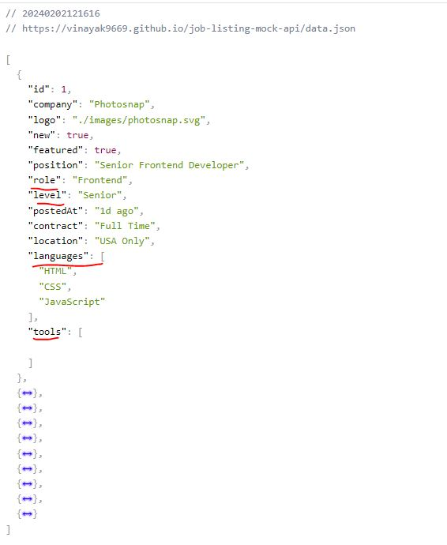
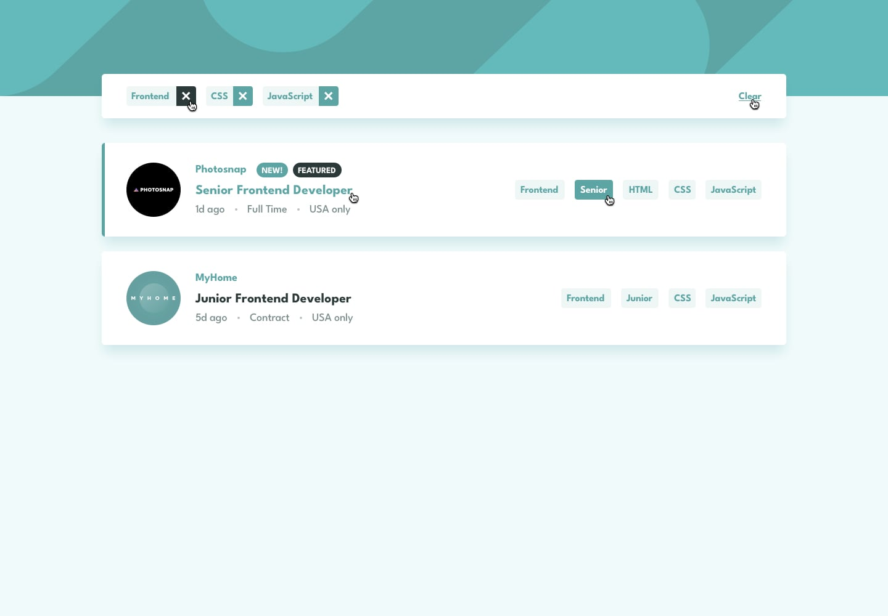

# Job Listing App with Filter 🚀

This project is a Frontend Mentor challenge where the goal is to create a website with specified features and design. The website allows users to filter job listings based on various criteria and is implemented using React.js, Vite, ContextAPI, useReducer, Tailwind, and API integration.

## Live Demo 🌐

[Netlify Deployment](https://job-listing-frontend-mentor-challange.netlify.app/)  | 
[Frontend Mentor Challenge Link](https://www.frontendmentor.io/challenges/job-listings-with-filtering-ivstIPCt)   |
[Frontend Mentor Challenge Solution  Link](https://www.frontendmentor.io/solutions/responsive-job-listing-with-filter-UZX1J3GNHS)

## Tech Stack 🛠️

- **React.js**
- **Vite**
- **Tailwind CSS**
- **VS Code**
- **Git**

## Implementation 🚧

- **State Management:** ContextAPI, useReducer
- **Responsive Design:** Ensures optimal viewing experience across various devices.

## App Features 🌟

1. **Responsive Design:**
   - The website is designed to provide a seamless user experience on different devices.

2. **Job Filtering:**
   - Users can filter job listings based on Position, Level, Languages, and Tools.

3. **Hover and Pointer Implementation:**
   - Enhances user interaction and provides a clear understanding of UI elements.

4. **Category Management:**
   - Users can add, delete, and clear categories for efficient job filtering.

## Proud Achievements 🏆

- **Challenging API Data Filtering:**
  - Implemented a robust solution to filter job listings based on user-selected categories, managing global state efficiently.

## Code Sample 🧾

```javascript
// Add Keys to the array called `keyWords`
function addFilterKeyWords(keyword) {
  if (!keyWords.includes(keyword)) {
    dispatch({
      type: 'job/addKeyWord',
      payload: keyword,
    });
  }
}

// Filter the `joblist` using keywords arrays `keyWords`
function filterJobsByLanguages() {
  // If the length of the keyWords is less than zero than no need to filter instead we pass the API data
  if (keyWords.length > 0) {
    const newData = jobList.filter((currData) => {
      return keyWords.every((key) => {
        return (
          currData.languages.includes(key) ||
          currData.role === key ||
          currData.level === key ||
          currData.tools.includes(key)
        );
      });
    });

    dispatch({ type: 'job/FilteredList', payload: newData });
  } else {
    // Pass the API data to the filter array if there are no categories selected
    dispatch({ type: 'job/FilteredList', payload: jobList });
  }
}

function deleteKeyword(keyword) {
  const newKeyWords = keyWords.filter((key) => key != keyword);

  dispatch({
    type: 'job/addNewKeyWord',
    payload: newKeyWords,
  });
}

function clearKeywords() {
  dispatch({
    type: 'job/addNewKeyWord',
    payload: [],
  });
}

```
## API Screenshots 📸

The underline properties we need to filter as a category.



## Application Screenshots 📱

<div align="center" height="350px">
  
   
</div>



